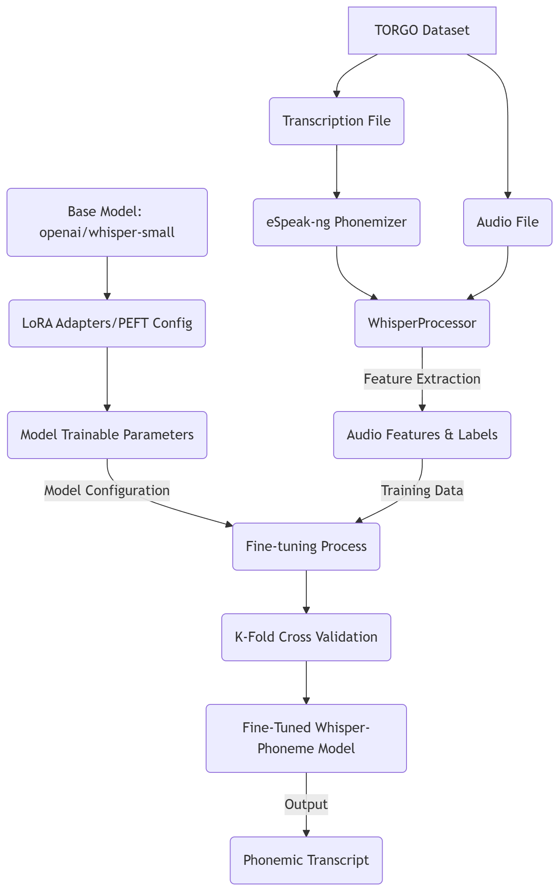
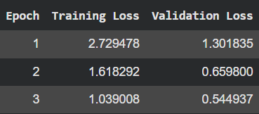
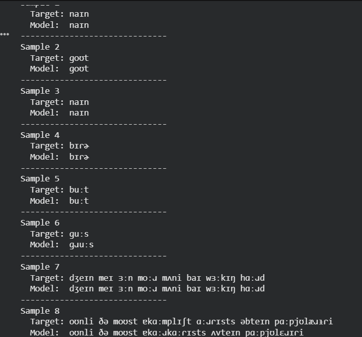
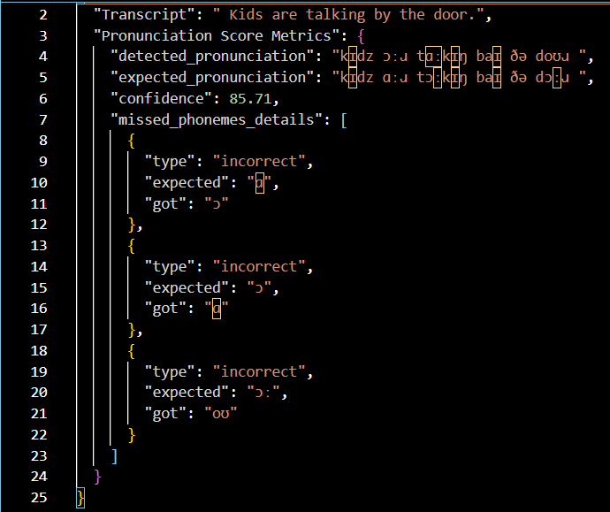

# Fine-Tuning Whisper for Phonemic Transcription of Impaired Speech

## Project Purpose
This project was developed with the primary purpose of assisting a multi-model architecture with properly identifying mispronunciations.

## Project Overview
The primary objective of this project is to create an Automatic Speech Recognition Model (ASR) that is compatible with impaired speech. Standard ASR models have the tendency to autocorrect transcriptions. For impaired speech, this would result inaccurate transcriptions as the ASR models can mistake words said in the audio sample for something that was not said. This model is fine-tuned to produce phonemic transcriptions to increase transcription accuracy while being able to sucessfully adapt to impaired speech.

## Dataset
The model was trained using [TORGO Dataset](https://huggingface.co/datasets/abnerh/TORGO-database)

This dataset consists of a mix of dysarthic and non-dysarthic audio samples. The model was trained by focusing only on the provided audio and transcriptions to prevent the model from developing bias during training.

## Model Workflow
- **Model Used**: OpenAI Whisper-Small
- **Architecture**: Encoder-Decoder Transformer fine-tuned using PEFT/LoRA (Parameter-Efficient Fine-Tuning) to manage computational resources.
- **Phoneme Mapping**: The transcripts from the dataset were converted into phonemes using eSpeak-ng to help the model focus on identifing phonmes in audio instead of words.
- **Optimaization**: Implemented k-fold cross validation to prevent overfitting. This assisted in making sure the model would be able to adapt properly to the impaired speech samples in the dataset as well.

## Results

### Training Results

Testing Loss: 0.239

### Sample Outputs from Testing

## Implementation
Integrating the model into the mulit-model archetechture provides the following output: 

This demonstrates the model's ability to help provide accurate scoring and a list of mispronunced phonemes, creating the ability to provide feedback personalized for speech therapy.